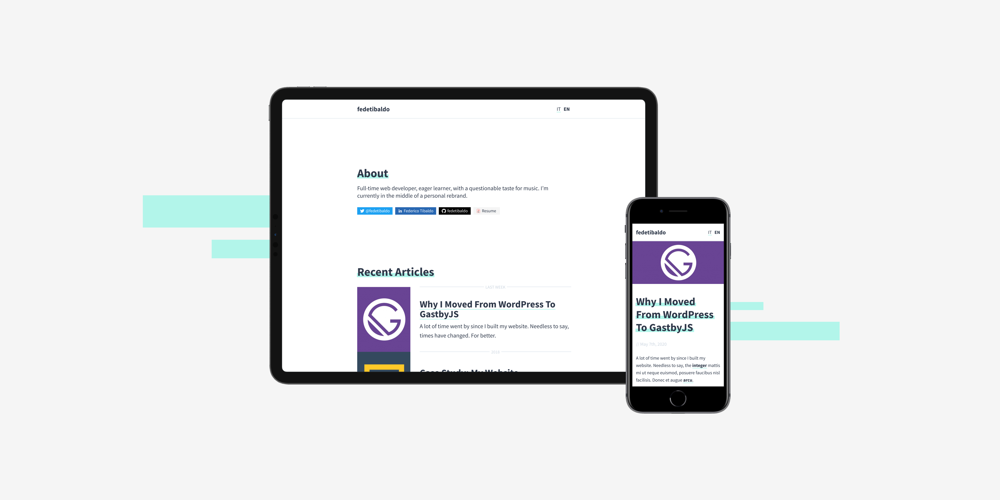

# fedetibaldo.com

The code of my personal website. Made with [Ghost](https://ghost.org) & [Gatsby](https://gatsbyjs.org).

**Link:** https://fedetibaldo.com

![status][status]

[status]: https://img.shields.io/website?down_color=red&down_message=offline&up_color=green&up_message=online&url=https%3A%2F%2Ffedetibaldo.com



# Installing

```bash
# With Gatsby CLI
gatsby new fedetibaldo.com https://github.com/fedetibaldo/fedetibaldo.com.git
```

```bash
# From Source
git clone https://github.com/fedetibaldo/fedetibaldo.com.git
cd fedetibaldo.com
```

Then install dependencies

```bash
yarn
```

# Running

Start the Ghost instance with Docker.

```bash
docker-compose up -d
```

Start the development server. You now have a Gatsby site pulling content from headless Ghost.

```bash
gatsby develop
```

By default, the starter will populate content from the default Ghost install located at http://localhost:3001.

To find out how to change this setting and what to do in case you're a Ghost(Pro) user, visit the [gatsby-starter-ghost repository](https://github.com/TryGhost/gatsby-starter-ghost#running).

# Extra options

```bash
# Run a production build, locally
gatsby build

# Serve a production build, locally
gatsby serve
```

Gatsby `develop` uses the `development` config in `.ghost.json` - while Gatsby `build` uses the `production` config.

# Copyright & License

Released under the [MIT license](LICENSE).
